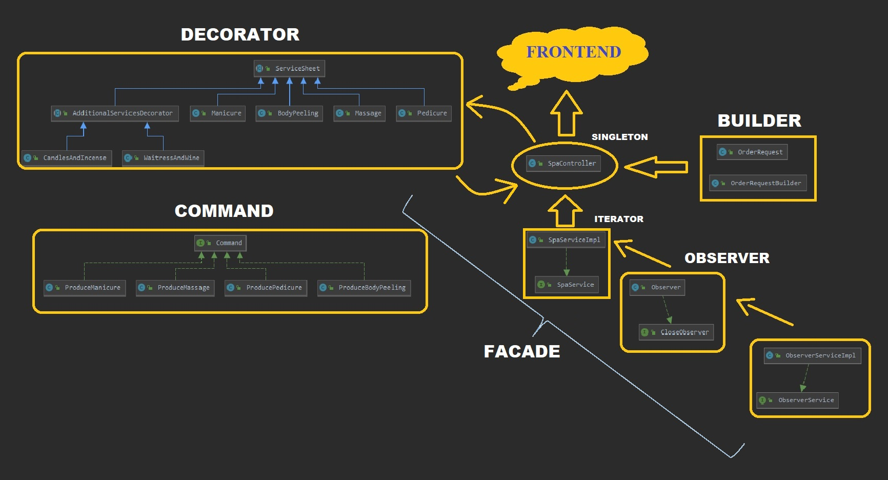
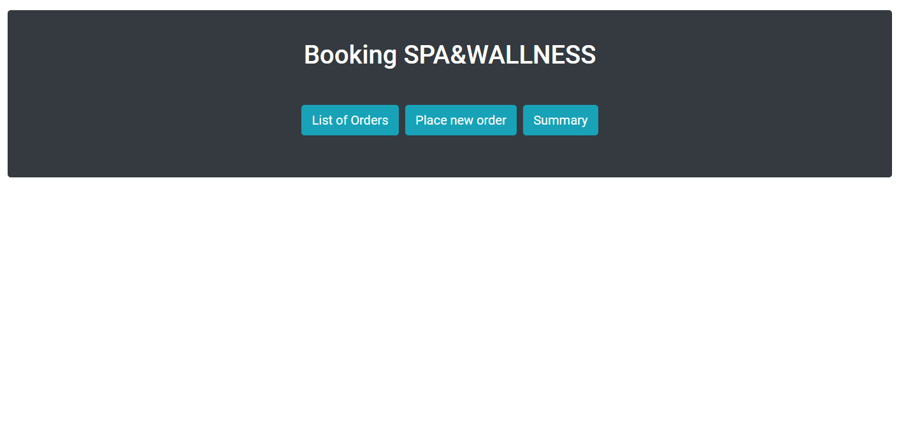
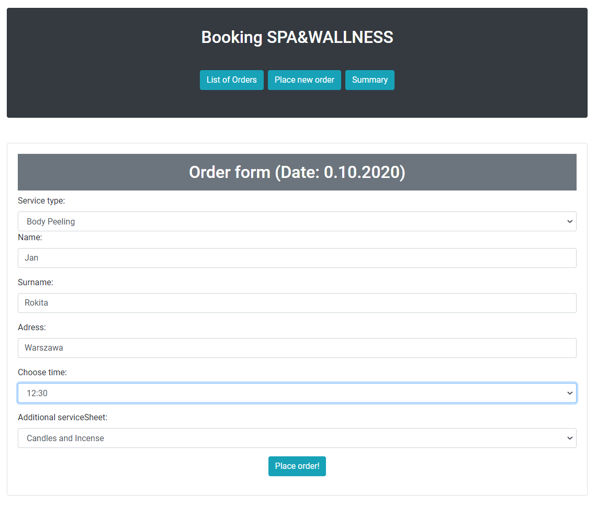
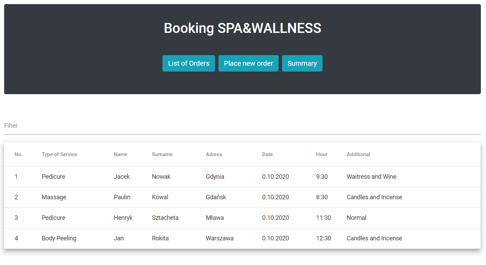
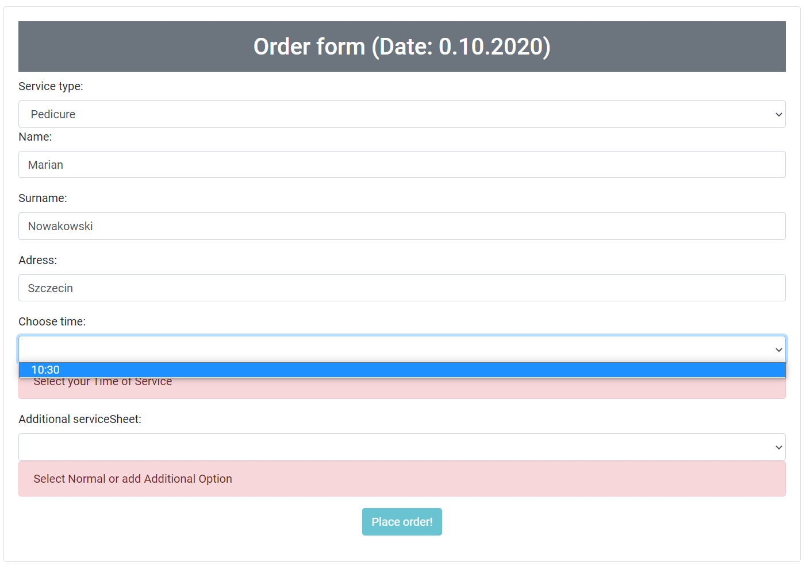
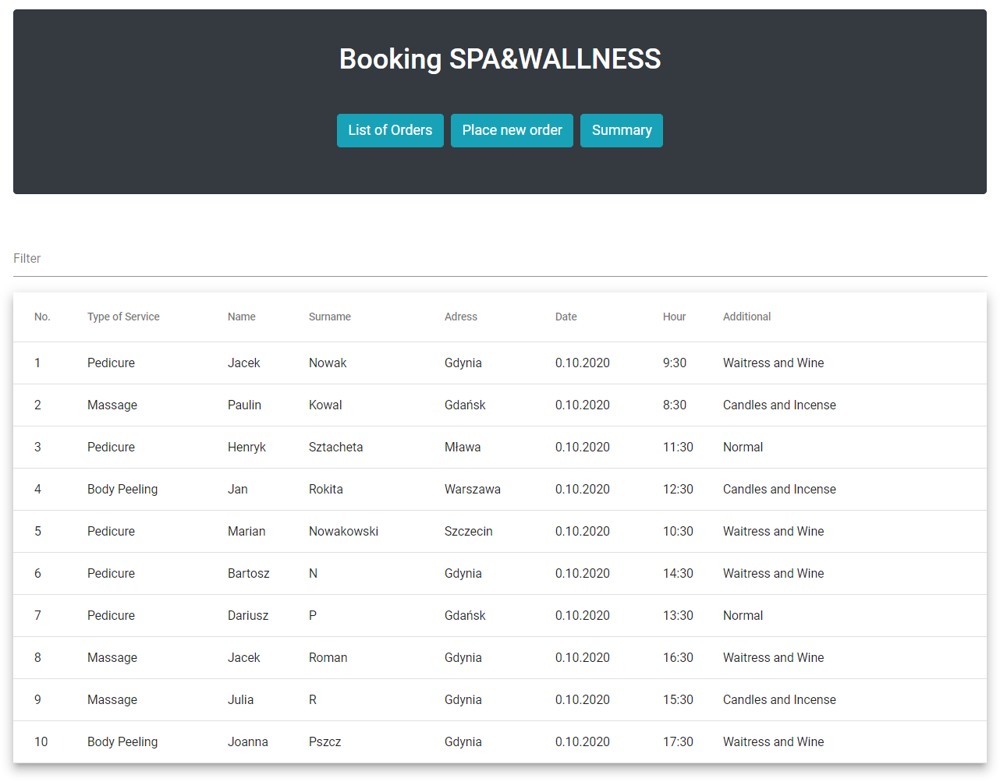
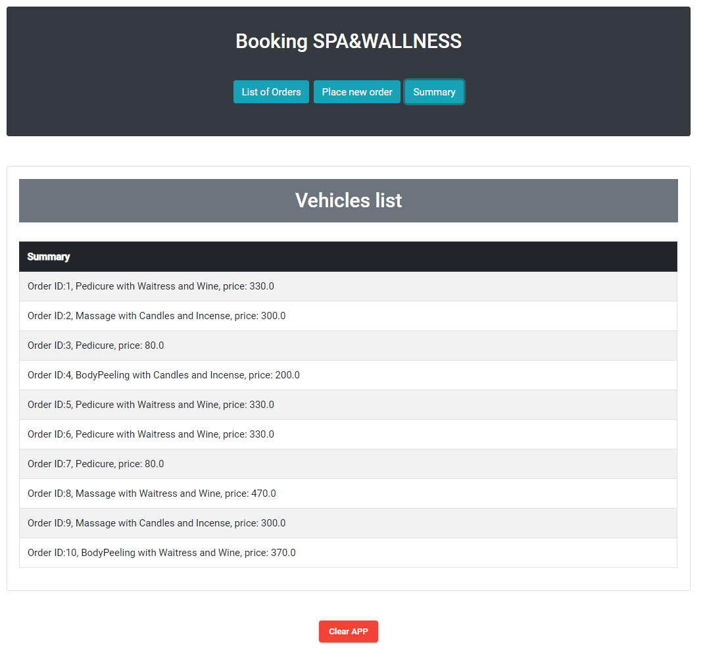

# book-spa-backend
Backend in Java.
This is an application for booking services in a mobile spa. The customer can place an order in the appropriate panel.
The owner wants to make sure he has the morning hours booked. 
After booking the first bank of (earlier) hours, the next bank is made available so that the next customer can select only later hours.

Design patterns implemented in project:
- Observer (to take objects in proper moment)
- Builder (easier creating OrderRequest instance)
- Decorator (avoids creating an intricate klass structure)
- Command
- Facade
- Singleton (Spring Bean)

UML of app:

Main view:

Panel for booking hours:

List of orders:

Bank of hours:

Full list:

Summary:

